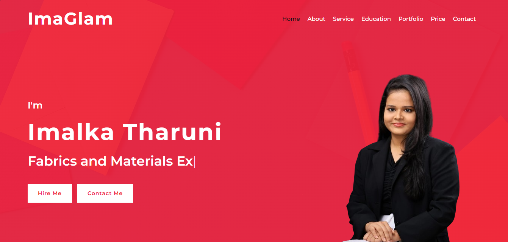
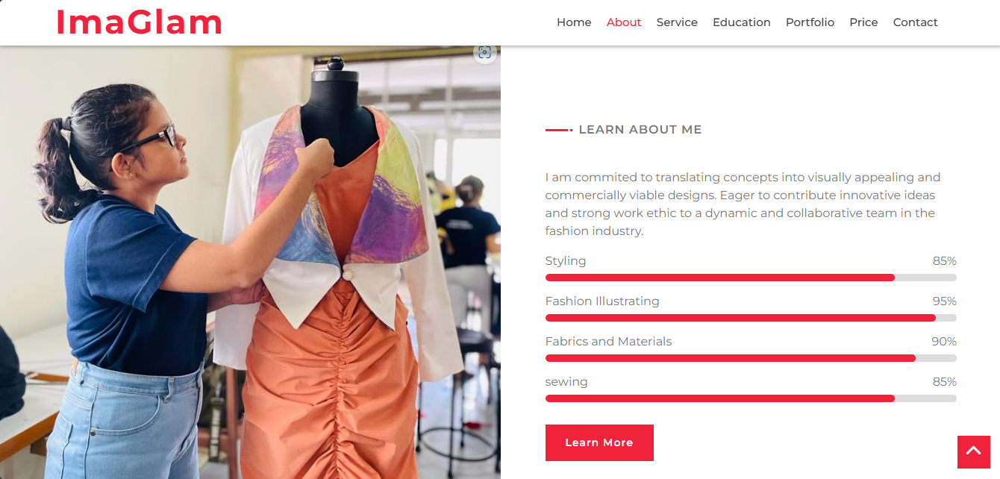
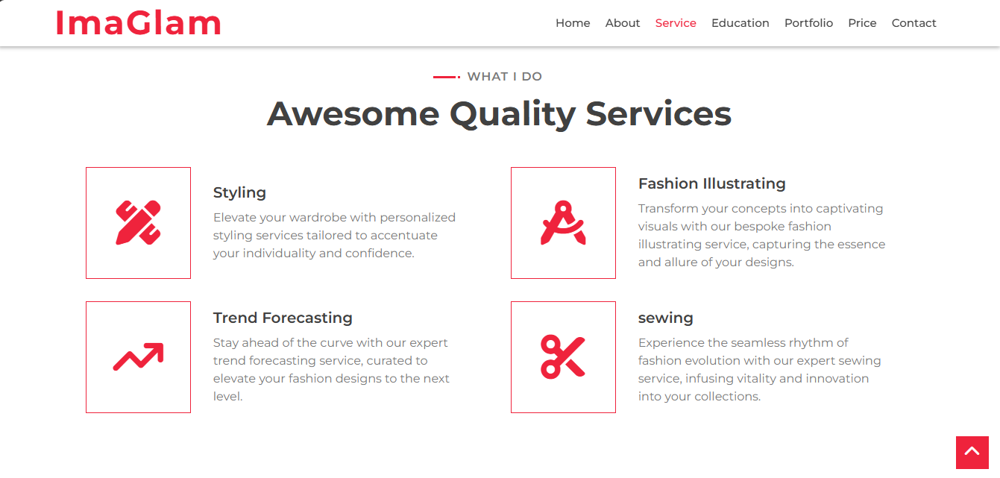
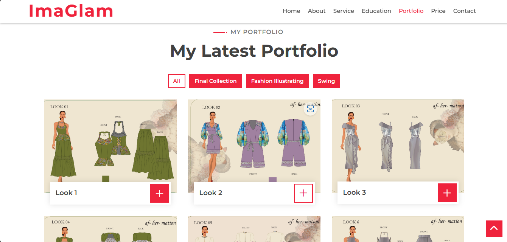
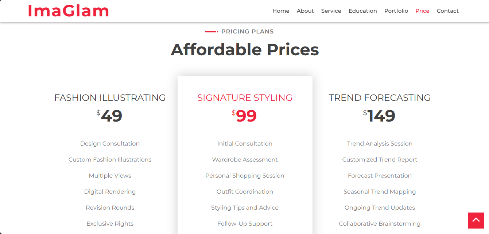
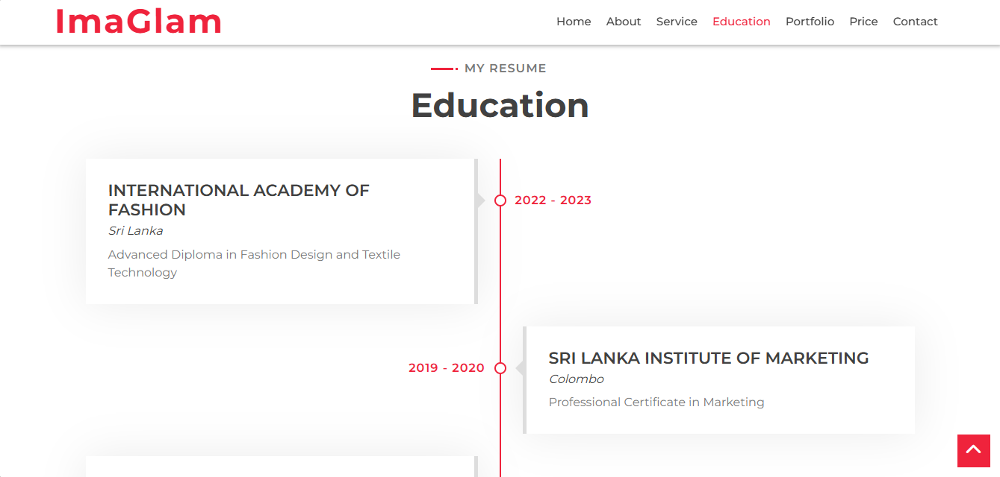
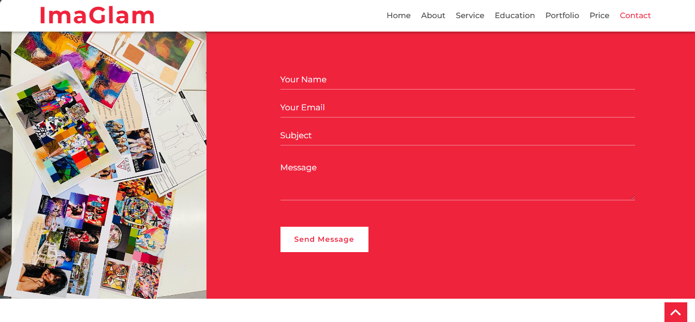

# ImaGlam

## 1. Description

ImaGlam is a portfolio website designed to showcase the skills, educational qualifications, services, and portfolio of a fashion designer. The website provides a platform to highlight the designer's work and make it accessible to potential clients. It includes sections for the designer's bio, a gallery of past projects, a detailed list of services offered, pricing, and a contact form for inquiries.

## 2. Features

- **Portfolio Gallery**: Display a collection of the designer’s work in a visually appealing gallery.
- **Contact Form**: A form that allows visitors to easily get in touch with the designer.
- **Responsive Design**: The website is fully responsive, ensuring a seamless experience across different devices and screen sizes.
- **Pricing**: Detailed pricing information for the services offered by the designer.
- **Education**: A section dedicated to showcasing the designer’s educational background.

## 3. Technologies Used

- **HTML**: For structuring the content of the website.
- **CSS**: For styling and layout of the website.
- **JavaScript**: For interactive elements and enhanced user experience.

## 4. Installation

To set up the website locally, follow these steps:

1. **Download the Project**: Download the project as a ZIP file or clone the repository.
2. **Unzip the File**: If you downloaded the ZIP, unzip it to a directory of your choice.
3. **Open in Browser**: Open the `index.html` file in your preferred web browser to view the website.

No additional installation steps are required as the project is built using only HTML, CSS, and JavaScript.

## 5. Usage

Once the website is running, you can navigate through the following sections:

- **Home**: An introduction to the designer and a brief overview of services.
- **Portfolio**: A gallery showcasing the designer’s previous work.
- **Services**: A detailed list of services offered by the designer, including pricing.
- **Education**: Information about the designer’s educational background and qualifications.
- **Contact**: A form for visitors to get in touch with the designer for inquiries or consultations.

Use the navigation menu to explore different sections of the website. The site is fully responsive, so it can be viewed on devices of any size.

## Screenshots

